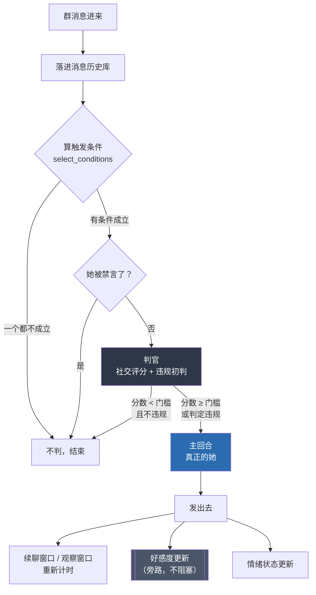
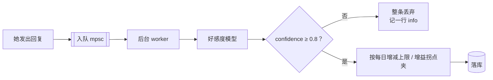

# QQ 群消息：从进来到发出去

一条群消息在 Miyu 里要过四道关：**窗口判定 → 触发条件 → 判官 → 主回合**。这份文
档说清每一道关的判据、它们重叠时会怎样、以及三个模型各自看到什么。

代码在 `crates/miyu-hosts/src/platforms/plugins/real_context/`：
`inject.rs`（编排）、`targeting.rs`（触发条件）、`runtime.rs`（窗口状态）、
`judge.rs`（判官）、`affection/`（好感度）。

## 全链路



判官跑完到主回合开口之间隔着几秒到几十秒。**这段时间里群里的新消息，判官没看
见、主回合看得见**——这是有意的（见下面的上下文对照）。

## 触发条件：可以同时成立，加分叠加

`select_conditions` 返回的是一个**集合**，不是单选。

| 条件 | 判据 | 窗口 | 加分 | 配置项 |
|---|---|---|---|---|
| `direct` | @她 / 私聊 / 命令 | — | +0.3 | `takeover_direct_trigger_boost_score` |
| `inherited` | 覆盖窗口内沿用上一轮 | 7s | 看继承到的是什么 | `active_reply_supersede_enable` / `active_reply_supersede_window_seconds` |
| `continuation` | **同一个人**又说话 | 15s | +0.1 | `continuation_enable` / `continuation_window_seconds` / `continuation_boost_score` |
| `after_speaking` | 她刚发过言，**任何人**说话（纯表情包除外） | 30s | +0.15 | `after_speaking_enable` / `after_speaking_window_seconds` / `after_speaking_score_boost` |
| `probability` | 摇中骰子 | — | 0 | `active_judge_probability`（默认 5%） |
| `moderation` | 命中违规关键词 | — | 0 | `moderation_enable` / `moderation_keywords` |

**两件事要分清**：

- **加分按成立的条件求和**，不封顶。她刚发完言（观察窗口开着）时有人 @ 她，
  `+0.3 + 0.15` 两份都拿到——回复意愿本来就该更高，冷静机制在另一头压着。
  （判官侧一直是 `final_score += continuation_boost + system_trigger_boost +
  after_speaking_score_boost`；09-19 之前卡住叠加的是 `inject.rs` 让它们互斥。）
- **主触发（`primary()`）只用于归类**：好感度算不算「直接互动」、要不要注入
  `<qq-join-in>`、日志标题写「续聊窗口判断」还是「主动回复判断」。优先级：
  `direct > inherited > continuation > after_speaking > probability > moderation`。

**`moderation` 是旗子，不是触发类型**（09-19 改）：有社交条件时它只让判官认真查
一眼违规（判官本来就在查，`moderation_check_enabled` 只看 `moderation_enable`）；
一个社交条件都没有时才由它把判断拉起来，走 `moderation_only`。

> 09-19 之前它排在优先级第二位、会抢断社交触发：你正跟她聊着、说了一句含关键词
> 的话，trigger 就被降成 Moderation，不是真违规就一声不吭，连续聊窗口都跟着断
> 掉。而违规检查本来就与 trigger 无关，降格换不来任何东西。

### 覆盖窗口（「发错了马上改」）

判据只有两条：**同一个 `sender_id`** + 那条 pending 还在 `active_reply_supersede_window_seconds`（默认 7s）内。**完全不看原始触发是什么**——观察窗口触发的那条消息同样会留下 pending，同一个人在 7 秒内补发，一样能覆盖。

继承时**保留原始触发标签**（08-29 定位、08-31 修）：标签要拿去做好感度归类和 `<qq-join-in>` 注入判据，一律写成 `Supersede` 会让路人在观察窗口里的一句话被记成「跟她直接互动」。

上一条已承诺（判官判过要回）就直接顶替、连判官都不再调；还没承诺就取消旧判断、带着原标签重判。

### 两个窗口是怎么重新计时的

`mark_continuation` 和 `last_reply` 在**同一处**更新，而且只在她**真的发出回复**
之后（`inject.rs`）。所以：

- 她回完 A → 续聊窗口（只认 A，15s）和观察窗口（认所有人，30s）同时开；
- A 在窗口内再说话 → `continuation` + `after_speaking` 都成立，归类取续聊；
- 路人 B 说话 → 续聊只认同一个 `user_id`，天然不成立，归类是观察窗口
  ——**不会被记成「跟她直接互动」去喂好感度**；
- 判断结果是「不回复」→ 两个窗口都不续命，自然到期。

## 三个模型各自看到什么

QQ 侧真正会调模型的只有两个判断（情绪是纯计算，不调模型）。

| | 主回合（真正的她） | 判官（社交 + 违规） | 好感度更新 |
|---|---|---|---|
| 群聊历史条数 | `reply_context_window`（25） | `judge_context_window`（20） | 同判官（09-19 前硬编码 12） |
| 取哪一段 | 上次回复的水位 → **查询那一刻** | **触发消息之前** | 最近 N 条，不设刀口 |
| 形态 | 增量；上轮渲染过的在会话历史里逐字重放 | 每次重新捞一段快照 | 每次重新捞一段快照 |
| 人格提示词 | `PromptAudience::External` | `Internal`（可被 `judge_persona_prompt` 整个替换） | `Internal` |
| 本次消息 / 本次回复 | 当前消息排在历史块之后 | 当前消息单独渲染 | 两段都单独给 |
| 记忆召回 | 有 | 无 | 无 |
| 工具 | 有 | 无 | 无 |
| 好感度 | 不注入正文（v7 起撤），靠 `query_qq_relationship` 查 | 以**分数偏置**进去 | 它自己在算 |
| 情绪 | 尾部一行 `tone_hint` | 以 `emotion_adjustment` 分数进去 | 无 |
| 违规预检结论 | `<qq-moderation-precheck>` 块 | 它自己在判 | 无 |
| 表情包 / 技能 / 脚本 | 有 | 无 | 无 |

**刀口不同是有意的**（08-26）：判断可能跑几十秒，期间群里聊到哪儿，回复时就该看
到哪儿——拿判断那一刻的上下文作答等于永远慢一拍。

## 违规判定成立之后

不是「拦下来就完了」：`should_reply = true`，**主回合被叫醒**，预检结论以
`<qq-moderation-precheck>` 块注进 `turn_system_context`，并附一句「这只是内部预
检，你自己判断怎么安全自然地回，别泄露评分」。她照常以自己的身份回话。

## 好感度



- **只在她真的回复之后才更新**：没被她回过的人永远停在初始分（默认 10）——没互
  动就没关系变化，这是对的。
- **旁路，不阻塞回复**：`mpsc` 队列 + 后台 `tokio::spawn`。
- 一次最多 +2 / −10（`affection_delta_min/max`），每日 +6 / −15
  （`affection_daily_gain_limit/loss_limit`），分越高涨越慢（`affection_gain_pivot`）。

> **09-19 修过一次**：评分规则原来只有五档、且明写「普通交流 0」，而群里绝大多数
> 互动就是普通对话——1834 次模型调用几乎全输出 0，187 个档案里 165 个停在初始值。
> 现在换成九档，最常见的那一档给 `0 到 +0.8` 的余地。丢弃日志也从 `debug` 抬到
> `info`（daemon 默认只记 error，原来整套系统对用户是不可观测的）。

## 违规关键词

**子串匹配**，ASCII 不分大小写（`targeting.rs::find_keyword`），还会对 base64 解
码后的文本再匹一次。所以短 ASCII 词是灾难：`OD` 会中在 `model` / `code` 里。

改完词表拿真实聊天记录审一遍：

```
python3 testkit/qq/keyword_audit.py                    # 用当前词表
python3 testkit/qq/keyword_audit.py --keywords new.txt # 试一份新的
```

> 09-19 按实测砍过一轮默认表：38878 条真实消息里，175 条词只有 57 条命中过，而命
> 中量的 88% 来自 22 个必然误报的词（`OD` 447 次、`64` 90 次、`盒`→沙盒 39 次、
> `节点`→背光节点 14 次……抽样里一条真违规都没有）。

## 配置项之间的隐式耦合

| 耦合 | 说明 |
|---|---|
| `judge_context_window` ↔ `reply_context_window` | 互相没有校验。把回复窗口调到 5、判官留 20，判官的判断依据在她回复时根本不存在 |
| 好感度历史条数 | 09-19 起跟随 `judge_context_window`，没有独立配置项 |
| `moderation_enable` | 关掉它，`moderation_candidate` 必然为 false——关键词表整个失效 |
| ~~`continuation_enable` → 观察窗口~~ | 09-19 已解耦，观察窗口有自己的 `after_speaking_enable` |
