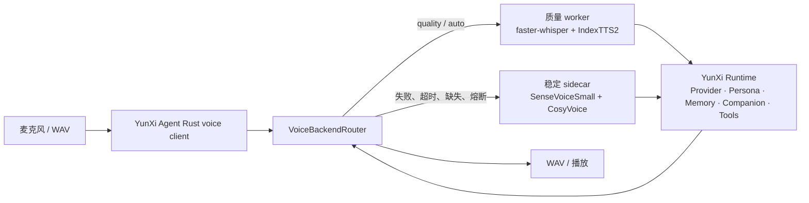

# YunXi Agent 语音质量双链升级记录

## 目标

在不改变既有 `语音 -> YunXi Runtime -> 回复 -> 语音` 主链的前提下，引入更高质量的本地 STT/TTS，并把稳定链作为永久兜底。语音模型不拥有对话、人格、记忆、陪伴、工具或审批权限。

## 运行结构

质量 worker 使用独立 Python 环境，避免 IndexTTS2 的 NumPy 2.2、Transformers 4.52 和 CUDA 2.8 依赖污染稳定环境。HTTP API 仍为 schema v1；未来实时流式能力单独设计为 WebSocket v2。

## 固定模型

| 端 | 模型 | 来源与固定版本 |
| --- | --- | --- |
| 稳定 STT | SenseVoiceSmall | `iic/SenseVoiceSmall` |
| 稳定 TTS | CosyVoice-300M-SFT | `iic/CosyVoice-300M-SFT` |
| 质量 STT | faster-whisper large-v3 | `SYSTRAN/faster-whisper` 1.2.1，模型 `Systran/faster-whisper-large-v3` |
| 质量 TTS | IndexTTS2 | 官方源码 commit `90ca4d608209584bad3a5bd5becc0b80c146e60f`，模型 revision `740dcaff396282ffb241903d150ac011cd4b1ede` |

IndexTTS2 使用其官方 `bilibili Model Use License Agreement`。源码、权重、辅助模型和用户参考音频只进入本机运行目录，不进入任一 Git 仓库。

## 路由与降级

- `stable`：只调用既有稳定模型，默认值。
- `quality`：逐端优先质量模型，质量端不就绪或失败时逐端回退。
- `auto`：质量端健康检查显示对应组件就绪时才调用，否则直接走稳定端。
- STT 失败只复用同一份内存音频给 SenseVoiceSmall；TTS 失败只复用同一段回复文本给 CosyVoice。
- 质量调用的超时、空转写、无效 WAV、导入失败、模型缺失、profile 损坏和推理异常都不会重跑 Agent turn。
- STT/TTS 各自拥有熔断器，默认连续 3 次失败打开 120 秒；稳定端失败才向上返回错误。
- 两个 TTS 都失败时仍保留文字回复，sidecar 故障时 Rust 客户端回到文字模式。

## VoiceProfile

`voice-profile.example.json` 是公开模板。真实 profile 必须位于被 Git 忽略的本机目录，至少提供中性参考音频和逐字转写；可选提供 gentle、happy、concerned、serious 等情绪参考。健康信息只暴露 profile id、情绪控制名称和兜底音色，不暴露音频路径或原文。

## 健康信息

`GET /health` 继续返回 schema v1，并增加可选字段：`mode`、`backends`、`active`、`fallback`、`circuit_breaker`、`capabilities`。旧版 Rust 客户端使用 serde 默认值忽略这些扩展；`v2.3.3-hotfix.20` 的 `voice doctor` 会显示当前模式、活动端和回退计数。

## 验证证据

- Python 单元测试：14 项通过，覆盖稳定模式、质量模式、auto 就绪判断、导入/异常/空结果/无效 WAV/超时、同一音频与文本降级、熔断、缺失/损坏/相对路径 profile。
- 进程级 mock 联调：CLI doctor、speak、chat 全部通过，工作区状态隔离。
- Rust：`cargo test --workspace` 全部通过；既有 CLI、TUI、微信、人格、记忆、陪伴、工具和安全回归没有失败。
- faster-whisper large-v3：RTX 5060 Ti 首次加载后真实识别成功，首次约 15 秒，加载后约 0.8 秒级请求。
- IndexTTS2：首次下载辅助模型并加载约 299 秒；热态合成约 2.4 秒，生成有效 22.05 kHz 单声道 WAV。
- 双质量模型与双稳定模型同时驻留：实测峰值约 13,276 MiB，低于约 14 GiB 目标。
- 50 轮真实质量循环：25 次 STT、25 次 TTS 全部成功，143.85 秒，回退计数为 0，熔断器未打开。
- 强制停止质量 worker 后，主 sidecar 仍使用稳定 STT/TTS 返回有效 WAV；Agent CLI `voice chat` 在隔离 Home/工作区中完整跑通。

## 尚未宣称的能力

当前质量链仍是半双工 HTTP v1，不宣称流式 STT、服务端流式 TTS、全双工插话或语音打断。下一阶段应在不改变 v1 的前提下设计 WebSocket v2，并继续保留本双链路作为 fallback。

## hotfix.21 / hotfix.22 跟进

- 中文短片段默认锁定 `zh`，只有显式设置 `YUNXI_VOICE_DEFAULT_LANGUAGE=auto` 才启用自动语言检测，减少中文被判成其他语言的问题。
- 质量 worker 默认在启动阶段预热已配置的 STT/TTS；启动器等待 `warmup.complete` 后再进入测试窗口。
- 预热实测等待约 15.6 秒，预热后首句合成约 6.0 秒，避免把 IndexTTS2 的 20～30 秒冷加载时间算进第一句回复。
