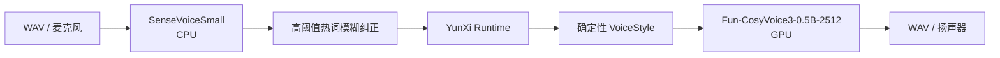

# YunXi Agent 语音单链迁移记录

## 目标

将原先同时驻留的 SenseVoiceSmall、CosyVoice-300M-SFT、faster-whisper large-v3 和 IndexTTS2 双链，收敛为一条可定制、可表达情绪且显存压力更低的本地语音链。

## 最终结构

当前进程不再导入 VoiceBackendRouter，不启动 quality worker，也不加载 faster-whisper、IndexTTS2 或 CosyVoice-300M-SFT。旧权重暂留磁盘，不进入显存。

## 工程决策

- SenseVoiceSmall 在 RTX 5060 Ti GPU 上与 CosyVoice3 同时驻留会显著拖慢 TTS；改用 CPU 后，真实 4.5 秒录音热态识别约 328 至 395ms。
- CosyVoice3 使用本机 `yunxi-primary` VoiceProfile 和 `inference_instruct2`，支持同一音色下的温柔、开心、关心、严肃、低落、惊讶和克制坚定语气。
- FunASR 模糊热词阈值从实验值 0.85 提高为 0.95，并取消默认全局热词。实验发现低阈值会吞掉“是”等助词，也会把普通“云溪”误改为名字。
- `realtime: true` 启用 CosyVoice3 模型内分块推理；HTTP v1 仍返回完整 WAV，不宣称服务端流式播放。
- 语音模型失败时保留文字回复，不重跑 Agent turn，也不加载另一语音模型。

## 本机实测

硬件：NVIDIA GeForce RTX 5060 Ti 16GB，Windows WDDM，PyTorch 2.8.0+cu129。

| 项目 | 结果 |
| --- | --- |
| CosyVoice3 独立加载 | 约 8.2s |
| CosyVoice3 CUDA 常驻 | `torch.cuda.memory_allocated` 约 3313MiB |
| CosyVoice3 CUDA 推理峰值 | 约 4280MiB |
| 单链服务启动 | 约 8.6s |
| SenseVoiceSmall CPU 直接热态识别 | 约 328 至 395ms |
| HTTP 真实录音识别 | 约 595ms，结果“你好，这是一条语音测试。” |
| CosyVoice3 首次短句合成 | 约 3.84s |
| CosyVoice3 热态短句合成 | 约 2.11s |
| 情绪验证 | gentle/happy 均为有效 WAV，长度与 SHA-256 不同 |

整机 `nvidia-smi` 数值包含 Windows 桌面和其他图形程序，不能直接等同于模型显存。模型内部 CUDA 统计比 WDDM 进程列表更适合比较本次迁移。

## 未完成能力

- HTTP 首包即播与真正的 text-in/audio-out 双流式协议
- 语音插话打断和全双工通话
- CompanionPolicy 直接输出结构化 VoiceStyle；当前仍由显式 emotion 或回复文本确定性选择
- 用户长期记忆和当前会话自动生成逐请求动态热词
