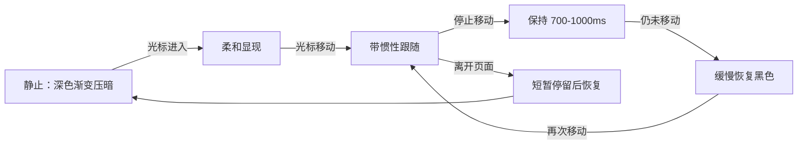

# YunXi Agent “她”页面人物素材与背景揭示交互需求文档

生成时间：2026-08-05 00:53:23 +08:00

状态：待人物与背景素材生成

署名：开发者

## 1. 项目背景

YunXi Agent Web 已具备“她”页面，用于展示 YunXi 的人物形象、关系阶段、灵魂状态、说话方式、陪伴方式和性格倾向。当前页面使用一张完整人物设定图，通过不同裁切区域分别展示全身、表情和完整设定。

本次需求将人物展示升级为多张独立素材，并为页面增加一张可交互的全屏背景图。背景默认由低饱和冷灰蓝渐变压暗，只保留极淡人物轮廓；光标经过时局部显现完整细节，显现内容短暂停留后自然恢复到柔和渐变状态，使页面具有探索感、陪伴感和时间感，同时保持 YunXi 现有石墨黑、冷白、深海军蓝和冰蓝视觉体系。

## 2. 目标

1. 使用独立人物素材替换当前对完整设定图的重复裁切。
2. 将人物展示模式调整为“全身 / 表情 / 日常瞬间”三种真实内容。
3. 增加全屏背景图，并实现“深色渐变压暗、光标揭示、短暂停留、缓慢恢复”的交互。
4. 保持人物身份、面部、服装、发型和配色在所有素材中一致。
5. 保持“她”页面现有关系数据、人格脱敏、记忆边界和后端接口不变。
6. 桌面、平板和手机均能稳定呈现，不产生页面级横向或纵向滚动。

## 3. 非目标

- 不修改 `/api/her` 返回结构和关系阶段算法。
- 不修改权威灵魂文件、人格内容或长期记忆。
- 不在图片中生成 UI、文字、关系数据或灵魂正文。
- 不引入视频背景、WebGL、Three.js 或持续高负载粒子系统。
- 不将页面改造成营销落地页、游戏属性页或社交资料卡。
- 不使用人物裸露、性感化、幼态化或与现有人设不一致的形象。

## 4. 设计原则

### 4.1 人物优先

人物仍是页面第一视觉中心。背景只负责建立空间和情绪，不得在亮度、细节密度或色彩饱和度上压过人物。

### 4.2 默认克制

页面静止时保留柔和、低饱和的冷灰蓝渐变，背景人物只显露极淡轮廓。用户主动移动光标后才逐步发现侧脸、发丝和服装细节。默认状态不能是无层次的纯黑。

### 4.3 探索而非追光灯

背景揭示不能像硬边圆形手电筒。揭示边缘需要柔和、具有惯性和衰减，光标移动后应留下短暂视觉余韵。

### 4.4 动画不损害阅读

背景交互不得覆盖正文、降低文字对比度、移动布局或造成按钮位移。人物切换不使用明显 blur，不产生闪白和弹跳。

## 5. 页面内容结构

桌面端采用“左侧角色卡 + 右侧背景人物”的镜像构图：

```text
左侧 32%–38%                  中部过渡区                  右侧 30%
独立人物卡片                  向中部延展的发丝            YunXi 近距离侧脸
全身/表情/日常切换            柔和渐变与揭示余韵          朝向左侧内容
```

关系阶段、人格摘要和性格信号不再与角色卡争夺右侧空间。默认态优先保留人物卡与背景关系；进入详情态后，角色卡保持在左侧，关系与人格信息在中部至右侧的可读层中展开。交互背景位于整个“她”页面内容之后，卡片和文字始终位于背景揭示层上方。

## 6. 素材交付清单

| 编号 | 建议文件名 | 内容 | 原始尺寸 | 比例 | 建议格式 |
| --- | --- | --- | --- | --- | --- |
| A1 | `yunxi-her-fullbody.png` | YunXi 单人全身立像 | 2048 x 2560 | 4:5 | PNG |
| A2 | `yunxi-her-expressions.png` | 六种克制表情合集 | 2048 x 2560 | 4:5 | PNG |
| A3 | `yunxi-her-moments.png` | 三个陪伴日常瞬间 | 2048 x 2560 | 4:5 | PNG |
| A4 | `yunxi-her-character-background.png` | 右侧侧脸与向中部飘散发丝的渐变人物背景 | 3840 x 2160 | 16:9 | PNG/JPG |

生图阶段保留原始文件。接入阶段再生成 WebP/AVIF，不覆盖原始素材。

## 7. 统一角色约束

以下内容必须放在所有人物生图提示词的最前方：

```text
严格以附带参考图作为唯一角色设定，不重新设计人物。保持完全一致的成年女性面部特征、五官比例、紫灰色眼睛、及腰深午夜蓝长发、发丝中的细微冰蓝光线、蓝色水滴耳饰、银色云纹胸针、白色半透明中式长外套、深海军蓝内裙、黑色短靴。保持同一年龄、同一身份、同一服装结构和配色。整体气质安静、清醒、温柔、克制，有明确的主观性和长期陪伴感。高级日系角色概念艺术，细腻但不过度梦幻，石墨黑、冷白、深海军蓝、少量冰蓝光作为统一色系。
```

建议参数：

- 参考图权重：`0.8–0.9`。
- 图生图重绘强度：`0.25–0.4`。
- 风格权重低于人物一致性权重。
- 不使用会显著改变五官、年龄和服装的随机风格模型。

## 8. 生图提示词

### 8.1 A1 全身主图

```text
[统一角色约束]

YunXi 单人全身立像，人物从头到脚完整出现，双脚不能裁切。自然站立，身体微微侧向镜头，目光平静地看向用户，一只手自然垂落，另一只手轻轻放在身前。发丝和半透明外套有非常轻微的自然流动感，不要夸张风吹效果。

纯净的深石墨黑背景，人物轮廓清晰，边缘干净，外套的白色半透明材质与黑色背景形成高级对比。人物周围只允许极少量冰蓝色微光和细小尘埃，不要光环，不要魔法阵，不要大面积发光。

构图为网页中央人物展示而设计，人物占画面高度约 88%，左右保留少量安全边距，头顶和脚下留有裁切空间。无文字、无边框、无设定表、无其他人物、无复杂场景。
```

验收重点：完整头脚、手部正确、人物居中、黑色背景干净、服装与参考图一致。

### 8.2 A2 表情图

```text
[统一角色约束]

YunXi 表情与情绪肖像合集，同一个人物、同一套服装、同一发型和饰品。画面包含六个精致的半身或近景肖像，自然分布在统一的深石墨黑背景中，不使用僵硬表格线。

六种状态分别为：平静注视、温柔微笑、认真倾听、若有所思、轻微担忧但保持克制、带有一点主观判断和不赞同的神情。

每个表情细微、真实、有层次，不做夸张动漫颜艺。肖像之间使用充足留白和少量冰蓝细线建立视觉秩序。整体像高级人物摄影选片墙，而不是传统角色设定表。无文字、无标签、无水印、无白色大背景。
```

验收重点：六张脸必须是同一人物，情绪可区分但不过度夸张，不生成文字和表格标题。

### 8.3 A3 日常动作图

```text
[统一角色约束]

YunXi 的三个陪伴瞬间，编辑式人物动作合集，统一深石墨黑背景，三个场景自然衔接，不使用漫画分镜边框。

第一幕：她坐在桌边安静书写一封信，暖白纸张和冰蓝微光照亮手部。
第二幕：她侧身认真倾听，目光温和但专注，表现真实陪伴而不是服务姿态。
第三幕：她抬手触碰一小片由记忆碎片组成的冰蓝光点，神情若有所思。

保持人物身份、面部和服装完全一致。画面有细腻的空间层次和安静的叙事感，留出大面积黑色负空间，适合网页裁切和轻微视差。无文字、无 UI、无魔法法阵、无夸张特效。
```

验收重点：动作不同但人物一致，手部正确，三个场景有叙事联系，背景不能过亮。

### 8.4 A4 右侧人物侧脸背景

```text
[统一角色约束]

为 YunXi Agent 的人物关系页面创作一张超宽横版人物背景图，专门用于深色渐变遮罩下的光标局部揭示。

YunXi 以大幅近距离侧脸和肩部轮廓出现在画面最右侧。侧脸主要集中在画面右侧约 70%–90% 的区域，面部朝向画面中部和左侧，形成看向左侧人物卡片与页面内容的自然视线。神情安静、清醒、温柔、克制。人物不是正面证件照，也不是完整全身立绘。

人物长发从右侧头部自然向画面中部略微飘散，发丝覆盖并连接画面约 38%–70% 的区域。发丝只能轻微飘动，保持自然重力和层次，不形成狂风或放射状头发。

画面左侧约 32%–38% 保留干净、稳定的深色负空间，供网页叠放独立人物卡片和交互控件。左侧不能出现第二个人物或复杂场景。

背景不能是纯黑色。使用柔和、低饱和、无明显分界的冷灰蓝渐变：左侧卡片留白区接近深冷灰 #171D23，中部接近石墨蓝灰 #252D36，右侧侧脸背后逐渐过渡为烟灰蓝 #3A4652。只在眼睛、耳饰、发丝和衣服边缘使用极少量 #A9D8E9 冰蓝高光。

人物自然融入渐变但不能完全消失。光标揭示后能够看清面部、眼睛、耳饰、发丝、衣领和云纹胸针。无文字、无 UI、无重复人物、无强烈镜头光斑。
```

验收重点：侧脸位于右侧、发丝向中部延展、左侧卡片留白完整，渐变柔和且不偏紫，不生成纯黑背景。

## 9. 统一负面提示词

```text
未成年，幼态，萝莉，性感化，暴露服装，夸张胸部，角色重设计，不同发色，不同眼睛颜色，短发，服装变形，饰品缺失，脸部不一致，多个相同人物，多余肢体，多余手指，错误手部，脚部裁切，低清晰度，过度磨皮，塑料质感，强烈紫色霓虹，赛博朋克城市，巨大光环，魔法阵，光球装饰，过度辉光，镜头耀斑，文字，乱码，Logo，水印，UI 面板，白色背景，传统角色设定表格
```

## 10. 背景揭示交互

### 10.1 图层结构

从下到上：

1. A4 右侧人物侧脸背景图片。
2. 半透明冷灰蓝渐变覆盖层。
3. 柔边揭示遮罩和短暂残影层。
4. 本地 ASCII 中景纹理。
5. 关系信息、人物素材、性格信号和导航。

背景与遮罩必须设置为不可交互层，不拦截按钮、滚动或文字选择。

### 10.2 桌面光标行为

- 初始状态：保留烟灰蓝到深冷灰的柔和渐变，背景人物可见度约 4%–8%，不能显示为纯黑平面。
- 光标进入页面：在 `180–240ms` 内显现柔边区域。
- 揭示半径：桌面 `220–300px`，平板 `160–220px`。
- 跟随延迟：视觉中心比真实光标滞后约 `70–120ms`，避免机械粘连。
- 边缘羽化：揭示区域外缘至少占半径的 35%，禁止硬边圆环。
- 光标停止：保持最后揭示区域 `700–1000ms`。
- 停止后恢复：用 `1200–1800ms` 缓慢恢复黑色。
- 光标重新移动：立即取消恢复，继续从当前位置揭示。
- 光标离开页面：短暂停留 `250–400ms`，然后在 `800–1200ms` 内恢复。
- 最多保留 1 个主揭示区域和 1 个极弱残影，不积累大量光斑。



### 10.3 人物切换行为

- 默认模式：全身。
- 第二模式：表情。
- 第三模式：日常瞬间，替换现有“完整设定图”。
- 控件继续使用三个图标按钮，不直接显示常驻文字；悬停时显示工具提示。
- 切换总时长 `320–480ms`。
- 动画由轻微透明度、`0.985–1.0` 缩放和不超过 `8px` 位移组成。
- 不使用 blur、弹簧弹跳、3D 翻牌或明显闪白。
- 连续快速点击时只保留最后一次选择，旧动画必须被取消或覆盖。

### 10.4 手机与触控

- 不持续跟随触点。
- 用户点击空白背景时，以触点为中心显现半径 `120–170px` 的区域。
- 保持约 `900ms` 后，在 `1000–1400ms` 内恢复黑色。
- 滑动档案区域时不触发背景揭示。
- 页面本身不滚动，继续使用现有内部档案滚动区。

### 10.5 减少动效

`prefers-reduced-motion: reduce` 下：

- 禁止惯性跟随、残影和持续动画。
- 背景保持固定的低亮度状态，或只执行不超过 `120ms` 的简单透明度变化。
- 人物切换立即完成或使用短透明度过渡。
- 不加载仅用于本交互的远程动画依赖。

## 11. 响应式要求

### 桌面：大于 1160px

- 独立人物卡片固定在左侧，右侧背景侧脸朝向左侧内容。
- 背景覆盖整个“她”页面视口，发丝从右侧向中部延展。
- 角色卡切换全身、表情和日常素材，不能遮挡右侧背景人物五官。

### 平板：781–1160px

- 角色卡仍保持左侧或左下位置，背景人物保留在右侧。
- 背景揭示半径减少，避免覆盖大面积正文。
- 关系与性格信息进入独立内部滚动层，不与人物卡重叠。

### 手机：不大于 780px

- 背景按右侧人物安全区域裁切，角色卡缩小后位于左侧。
- 档案内容位于下半屏内部滚动区。
- 背景只响应空白区域点击，不响应滚动手势。
- 三个模式按钮保持最小 `44 x 44px` 可触控区域。

## 12. 性能与格式要求

- 原始素材保留；Web 版本使用 WebP，并在可行时生成 AVIF。
- A1/A2/A3 单张 Web 资源目标不超过 `650KB`。
- A4 背景 Web 资源目标不超过 `1.5MB`。
- 默认只预加载 A1 和 A4；A2/A3 在浏览器空闲或首次悬停控制条后加载。
- 背景交互优先使用 CSS mask、transform、opacity 和复用动画控制器。
- 指针更新使用 `requestAnimationFrame` 或 GSAP `quickTo`，禁止每次 pointermove 创建新 timeline。
- 页面切换后暂停背景动画，避免不可见页面继续消耗资源。
- 背景图片加载失败时恢复为 CSS 冷灰蓝渐变，不影响人物和关系信息使用。

## 13. 可访问性要求

- 装饰背景、ASCII 纹理和残影统一 `aria-hidden="true"`。
- 人物图片提供准确但简短的 alt 文本。
- 三个模式按钮保留 `aria-label`、`title`、`aria-pressed` 和键盘焦点样式。
- 背景交互不能成为理解关系信息的必要条件。
- 文字对比度不能因背景显现降到 WCAG AA 以下。

## 14. 验收标准

### 素材验收

- [ ] A1 头、手、脚完整，人物身份和服装与参考图一致。
- [ ] A2 六种表情可区分，且全部是同一人物。
- [ ] A3 三个动作自然，手部结构正确，无文字和 UI。
- [ ] A4 侧脸位于右侧、发丝向中部自然延展、左侧角色卡留白完整，背景为低饱和冷灰蓝渐变。
- [ ] 所有图片无水印、乱码、Logo、白色大背景和生成式 UI。

### 前端验收

- [ ] 默认背景保留柔和冷灰蓝渐变和极淡人物轮廓，光标经过后才显现完整细节。
- [ ] 揭示边缘柔和，光标停止后会停留并恢复。
- [ ] 快速移动和快速切换人物模式时无闪烁、重叠和残留动画。
- [ ] 全身、表情、日常三个按钮均展示对应独立素材。
- [ ] 1920 x 1080、1440 x 960、1294 x 912、1024 x 768、390 x 844 均无页面级滚动和内容重叠。
- [ ] 断网、图片失败和 GSAP 不可用时页面仍可使用。
- [ ] 减少动效模式无持续跟随和残影。
- [ ] `/api/her`、灵魂脱敏和记忆边界没有变化。
- [ ] Chrome/Edge 控制台无错误，人物图和背景图均成功加载。

## 15. 实施顺序

1. 使用参考图生成 A1–A4，其中 A4 采用右侧人物侧脸背景方案，角色卡位于左侧。
2. 对人物一致性、手部、头脚裁切和暗部细节进行人工筛选。
3. 保留原始素材，生成 WebP/AVIF 派生版本。
4. 接入三张人物素材并替换现有裁切逻辑。
5. 接入背景和深色渐变揭示遮罩。
6. 完成桌面惯性跟随、停留恢复、触控点击揭示和减少动效降级。
7. 执行语法、Rust、浏览器、断网、移动端和安装版集成测试。
8. 记录开发日志，安装新版本并发布新的 annotated tag；不移动任何历史 tag。
